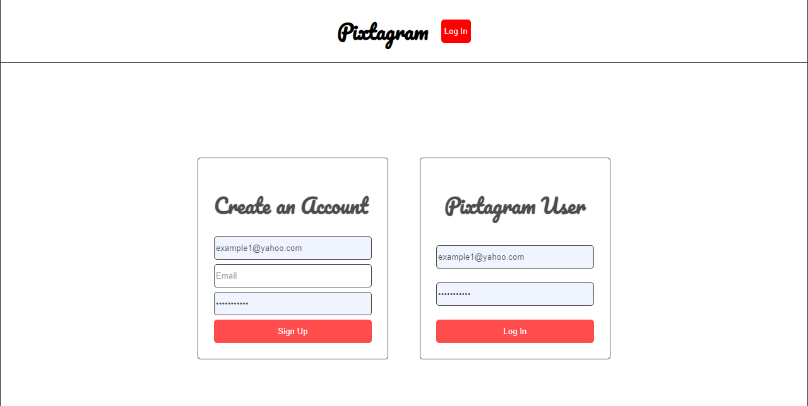

# Pixtagram

  ## Licensing:
  

  ## Table of Contents
  - [Description](#description)
  - [Installation](#installation)
  - [Usage](#usage)
  - [Contribution](#contribution)
  - [Testing](#testing)
  - [Additional Info](#additional-info)

  ## Description:
  Pixtagram is a social media site for people to upload photos and leave comments.  

  ## Installation:
  User should clone the repository and make sure to look at the package.json file to see which dependencies should be downloaded.

  ## Usage:
  To start the program, type 'npm start' to run the program.  Afterwards open up the localhost on your web browser and login in.  You may have to create a new profile.  Enter in the appropriate fields and you are good to go!
   

  ## Links
  **GitHub**: https://github.com/wcastellan/Pixtagram
  **Heroku**: https://fierce-journey-71940.herokuapp.com/

  ## Contribution:
  Wyatt C. Micheal S. Wesley D.

  ## Testing:
  No tests were written.

  ## Additional Info:
  - Github: [wcastellan](https://github.com/wcastellan)
  - Email: wyattcastellan@gmail.com 